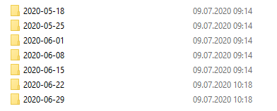

# Read a file from the most recent folder in a directory

I wrote a script which purpose is to look for the most recent folder within a directory based on the creation time of that folder. The script automatically reads a .csv file which is contained in each folder. However, if there is no folder for the current week yet, the script reads the .csv file from last week's folder.

Every week, a subfolder within this directory is created whereas the current date is used as a label:



The script uses the `file.info()` and `list.files()` functions from base R to list files within a directory and retreive information from these files (creation time, modification time, ...). The `lubridate` package is used to extract and compare the calender weeks. A simple if-else condition is used to decide which file should be loaded and to give the user a brief feedback. 

```r
# Packages
library(lubridate)
library(stringr)
library(data.table)

path <- file.path("PATH") # Set path to directory
dirs <- file.info(list.files(path, pattern = "^20(.*)$", full.names = TRUE)) # List files within directory

dir.curr <- rownames(dirs)[which.max(dirs$ctime)] # Use most recent file based on creation time
dir.prev <- rownames(dirs)[which.max(dirs$ctime)-1] # Second most recent file

# Extract calender week from most recent file
cw.last.file <- lubridate::isoweek(
  stringr::str_sub(dir.curr, -10,-1)
  )

# Current calender week
cw.curr <- lubridate::isoweek(Sys.Date())

# If there is a folder for current cw, use this. Otherwise, take last week's folder. Then, load the stock file within that folder.
if (cw.curr == cw.last.file) {
  message("Awesome! There is a current stock file. I'll load this one.")
  stock <- fread(file.path(dir.curr, "stock.csv"))
} else {
  message("There is no current stock file. I'll use last week's stock file.")
  stock <- fread(file.path(dir.prev, "stock.csv"))
}
```
It would be even possible to reduce the amount of packages needed. For example, the `data.table` package is not really necessary as the `fread()` function can be easily replaced by `read.csv()` from base R. 
